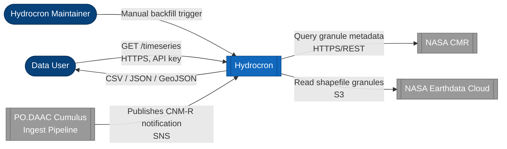
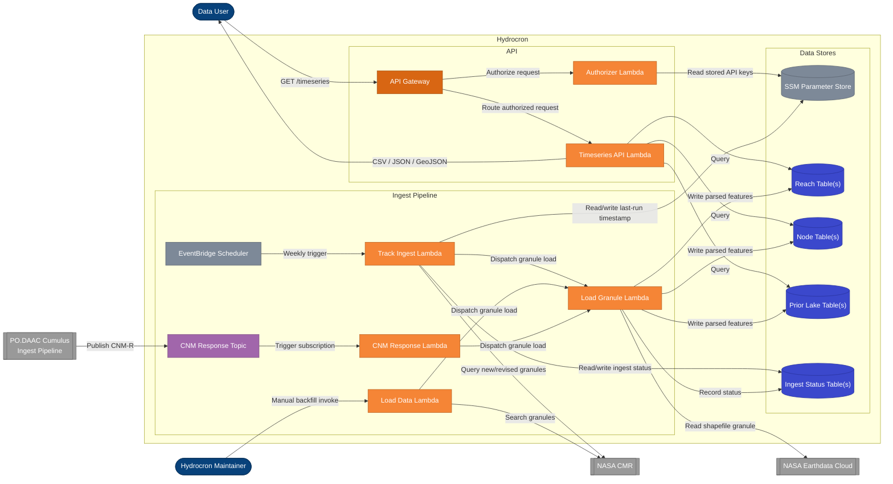
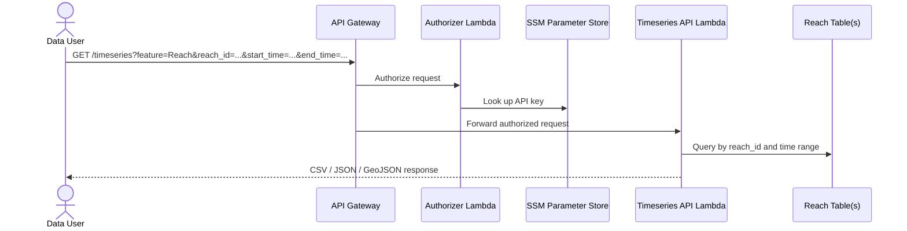
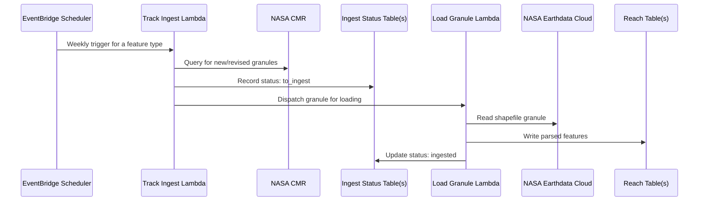

# Hydrocron Architecture

This document renders the Structurizr C4 model defined in [`docs/architecture.dsl`](docs/architecture.dsl) as
Mermaid diagrams so it's viewable directly on GitHub. That DSL file is the source of truth &mdash; if the
architecture changes, update it first and regenerate these diagrams to match.

## System Context

Hydrocron repackages SWOT hydrology granules into timeseries-friendly CSV, JSON, and GeoJSON, served over a
REST API.

## Containers

## API Query Flow

How a data user retrieves a timeseries.

## Scheduled Ingest Flow

How new SWOT granules are discovered and loaded on a weekly schedule.

